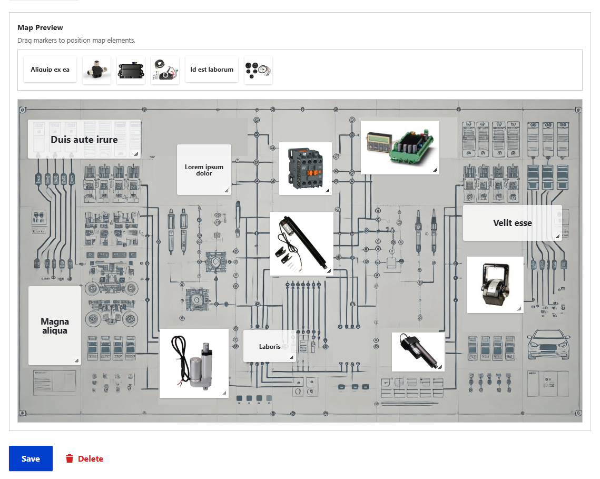

# Draggable Mapper

A Drupal module that provides a draggable mapper entity with interactive markers. This module allows content creators to easily create maps with interactive markers through a simple drag-and-drop interface.

## Overview

Draggable Mapper lets you place markers on an image map using a user-friendly drag-and-drop interface. Each marker can contain a title, description, and custom icon/image. This allows for creating interactive maps that can be used for various purposes.

## Features

- Custom entity type for map data
- Drag-and-drop interface for marker placement
- Resizable markers with responsive content
- Support for marker titles, descriptions, and custom icons/images
- Responsive design - maps work on all screen sizes
- Simple integration with Drupal's field system
- Separate view and edit experiences

## Use Cases



### Floor Plans and Building Maps
Create interactive floor plans for buildings, malls, or campuses with points of interest that visitors can interact with. Perfect for architectural diagrams, evacuation plans, facility maps, and similar visual schematics.

### Components in Systems
Create diagrams with components that can be interacted with, such as boat rigging systems, automotive parts diagrams, HVAC system layouts, electrical circuit diagrams, network infrastructure maps, industrial machinery schematics, or plumbing system overviews.

### Image Annotations
Add interactive markers to any image to create a more engaging content experience.

### Location Mapping
Upload a custom map image and mark important locations with descriptive popups.

### Educational Resources
Create interactive diagrams with explanatory markers for educational content.

## Requirements

- Drupal 9.x, 10.x or 11.x
- Paragraphs module
- Inline Entity Form module
- jQuery UI Draggable module
- jQuery UI Droppable module
- jQuery UI Resizable module

## Installation

1. Download and extract the module to your `/modules/custom` directory.
2. Install required modules using Composer:

   ```
composer require drupal/paragraphs drupal/inline_entity_form drupal/jquery_ui_draggable drupal/jquery_ui_droppable drupal/jquery_ui_resizable
   ```

3. Enable the module through the Drupal admin interface (`/admin/modules`) or using Drush:

   ```
   drush en draggable_mapper
   ```

## Usage

### Creating a Map

1. Navigate to Structure > Draggable Mapper Entities > Add Draggable Mapper (`/admin/structure/draggable-mapper-entity/add`).
2. Upload a map image.
3. Add a title and description for your map.
4. Save the map to start adding markers.

### Adding Markers

1. Edit your map entity.
2. Click "Add Marker" to create a new marker.
3. Fill in the title and description for the marker.
4. Drag the marker to the desired position on the map.
5. Resize the marker to the desired size.
6. Optionally, upload a custom icon for the marker.
7. Save the form to update the marker's position and details.

### Embedding Maps

Maps can be embedded in other content using an entity reference field or directly through their own URLs.

## Configuration

### Marker Display

Markers can be configured to show different information:
- Title only
- Title with expandable description
- Custom icon with tooltip title on hover
- Custom icon with expandable description

## Extending the Module

### Custom Field Integration

Additional fields can be added to markers through the Paragraph entity type. Add your fields to the `dme_marker` paragraph bundle.

### Theming

The map display can be themed by overriding the `draggable-mapper-entity.html.twig` template.


You can modify template variables using a preprocess function in your theme's .theme file:

```php
/**
 * Implements hook_preprocess_HOOK() for draggable-mapper-entity.html.twig.
 */
function MYTHEME_preprocess_draggable_mapper_entity(&$variables) {
  // Add or modify variables for the template
  $variables['custom_variable'] = 'Custom value';
  
  // Modify marker properties
  if (isset($variables['markers'])) {
    foreach ($variables['markers'] as &$marker) {
      // Example: Add a custom class to specific markers
      if (isset($marker['title']) && $marker['title'] == 'Special marker') {
        $marker['attributes']['class'][] = 'my-special-marker';
      }
    }
  }
}
```

## Troubleshooting

- If markers aren't draggable, ensure that the jQuery UI Draggable and jQuery UI Droppable modules are properly installed and enabled.
- For marker display issues, check browser console for JavaScript errors.
- Ensure the uploaded image file is web-optimized (reasonable file size and dimensions).
- **SVG Support for Marker Icons**: By default, Drupal's image fields have limited support for SVG files. If you need to use SVG files for marker icons:
  1. Install the excelent [SVG Image](https://www.drupal.org/project/svg_image) module: `composer require drupal/svg_image`
  2. Enable the module: `drush en svg_image`
  3. Add 'svg' to the allowed file extensions in the marker icon field settings (under Structure > Paragraph types > DME Marker > Manage fields > Icon > Edit)

## Contributing

Contributions are welcome! Please create issues and pull requests on GitHub.

## License

This project is licensed under the GPL v2 or later.
